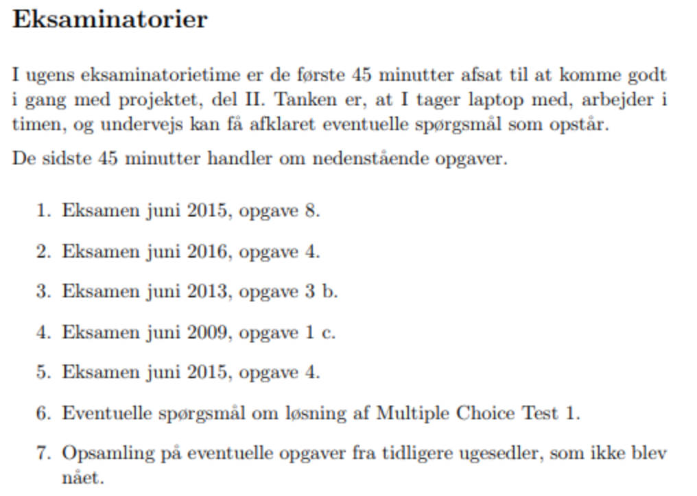
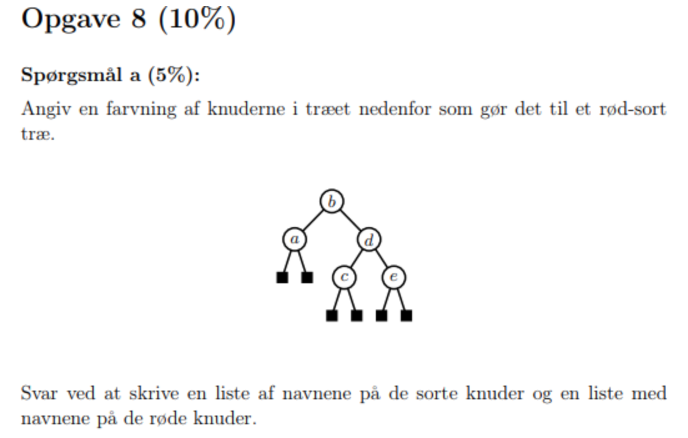
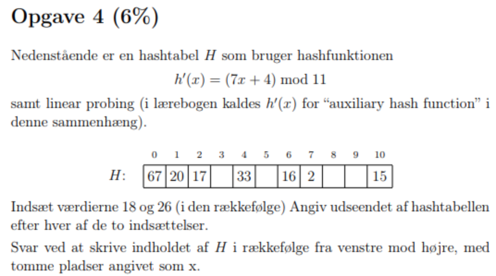
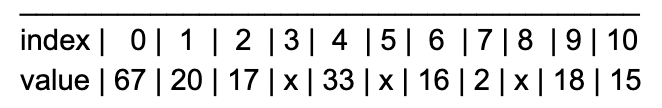
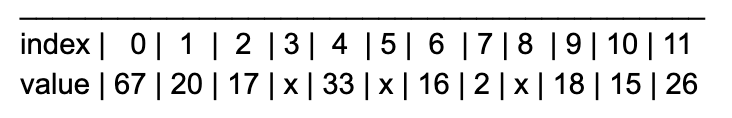
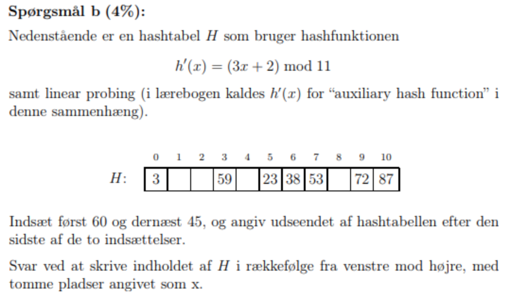
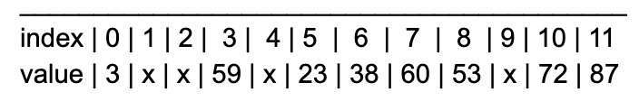
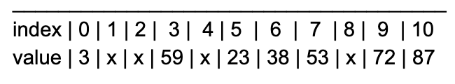
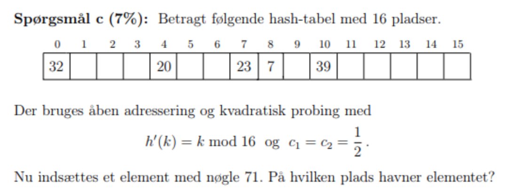
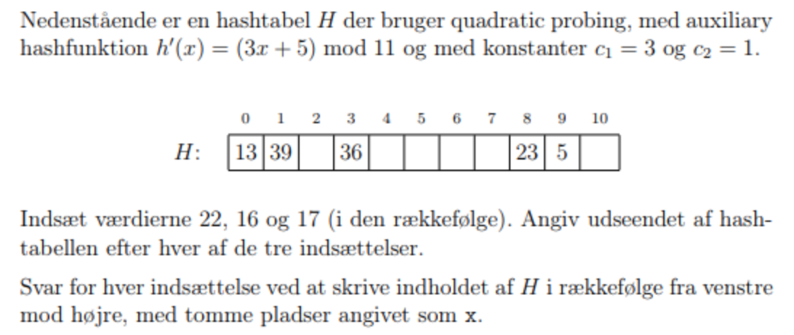

<h1>Eksamenatorier:</h1>

</img>

***
Der er åbentbart tilføjet flere opgaver på listen fra læreren, som omhandler nogle opgaver fra Cormen (bogen), men dem har vi sprunget over. Der er også nogle flere punkter, e.g. eventuelle spørgsmål... eller opsamling.. De er bare irrelevante.
***

## **1. Eksamen juni 2015, opgave 8.**
</img>

<b>ANSWER:</b>

    Sorte knuder: a, b, c, e.
    Røde knuder: d.

**
Personal notes:**

* **Link:** https://da.wikipedia.org/wiki/R%C3%B8d-sort_tr%C3%A6

* **Regel for at en rød-sort træ (hvad den skal indeholde):**
Alle knuder er enten røde eller sorte.
Rod-knuden er sort.
Alle blade er sorte.
Ingen rød knude har en rød knude som forælder.
Enhver sti fra rod-knuden til et blad indeholder det samme antal sorte knuder.

## **2. Eksamen juni 2016, opgave 4.**
</img>

<b>ANSWER:</b>
For 18:
h’(x) = (7*18+4) mod 11 = 9

Tallet indsættes i tabellen:

</img>

For 26:
h’(x) = (7*26+4) mod 11 = 10

Tallet indsættes i tabellen:

</img>

x = empty fields

**
Personal notes:**

* **Link:** https://en.wikipedia.org/wiki/Linear_probing 
* **Linear probing** = basically when elements share the same key, a new field will be created for the higher of the two keys (e.g. 15 and 26) where 15 will retain its position, and 26 will get a new field (in our case #11).

## **3. Eksamen juni 2013, opgave 3 b.**
</img>

<b>ANSWER:</b>
For 60:
h’(x) = (3*60 + 2) mod 11 = 6

Tallet indsættes i tabellen:

</img>

For 45:
h’(x) = (3*45 + 2) mod 11 = 5

Tallet indsættes i tabellen:

</img>

x = empty fields

## **4. Eksamen juni 2009, opgave 1 c.**
</img>

<b>ANSWER:</b>

c1 = c2 = 0.5

index = h’(71) = 71 mod 16 = 7

h (k, i) = h(k)+c1*i + c2*i²) mod 16

h (k, i) = 7+((0.5)*7²) + (0.5*7)) = 35

= 35 mod 16 = 3

Den skal ind på plads 3.

**
Personal notes:**

* **Link:** https://en.wikipedia.org/wiki/Quadratic_probing
* **Quadratic Probing - Fremgangsmåden:**
Vi starter med at finde index, på samme måde som vi tidligere har gjort (f.eks. med 71 som værdi):

        index = h’(71) = 71 mod 16 = 7

        Er C2 lig 0, anvendes linear probing, som vist tidligere, men såfremt C2 er større end 0, anvender vi følgende formel:

        h (k, i) = h(k)+c1*i + c2*i²) mod m (hvor m er det tal man skal bruge til modulo, eksempelvis 16)

        h (k, i) = 7+((0.5)*7²) + (0.5*7)) = 35

        = 35 mod 16 = 3

## **5. Eksamen juni 2015, opgave 4.**
</img>

<b>ANSWER:</b>

c1 = 3
c2 = 1

h’(22) = (3*22+5) mod 11 = 5

h’(16) = (3*16+5) mod 11 = 9 

h’(17) = (3*17+5) mod 11 = 1 

Formel:
h’(x)+c1*i + c2*i²) mod 11

Fremgangsmåde/Resultat:
for h’(22) = 5+(3*5 + 1*5²) = 45 
= 45 mod 11 = 1

den rykkes med 1*1 (1²) plads = 1 plads
den bliver derfor på plads 2

(regel: jf. personal notes)

22 går på plads 2

for h’(16) = 9+(3*9 + 1*9²) mod 11 = 7

16 går på plads 7

for h’(17) = 1+(3*1 + 1*1²) mod 11 = 5

17 går på plads 5

den endelige bliver:

13 | 39 | 22 | x | x | 17 | x | 16 | 23 | 5 | x 

**
Personal notes:**

* Link: (https://en.wikipedia.org/wiki/Quadratic_probing)
* Algorithm to insert key in hash table

        1. Get the key k
        2. Set counter j = 0
        3. Compute hash function h[k] = k % SIZE
        4. If hashtable[h[k]] is empty
            (4.1) Insert key k at hashtable[h[k]]
            (4.2) Stop
        Else
            (4.3) The key space at hashtable[h[k]] is occupied, so we need to find the next available key space
            (4.4) Increment j
            (4.5) Compute new hash function h[k] = ( k + j * j ) % SIZE
            (4.6) Repeat Step 4 till j is equal to the SIZE of hash table
        5. The hash table is full
        6. Stop

Source: Wikipedia - afsnit: Quadratic Probing Insertion