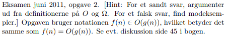
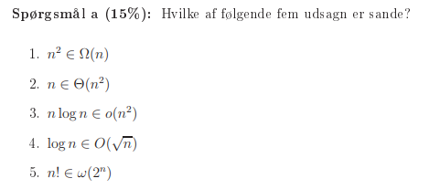
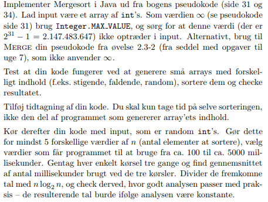
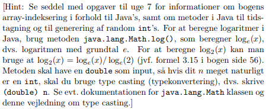

<h1>Eksamenatorier:</h1>

## 1. Eksamen juni 2008, opgave 2 
Tidligere eksamensopgaver kan findes øverst på kursets hjemmeside.

</img>

<b>ANSWER:</b>

    
## 2. Eksamen juni 2011, opgave 2
</img>

</img>

<b>ANSWER:</b>

## 3. Eksamen januar 2007, opgave 3
Opgaven bruger notationen f(n) ∈ O(g(n)), hvilket betyder det samme som f(n) = O(g(n))

</img>

<b>ANSWER:</b>

## 4. Implementer Mergesort i Java

</img>
</img>

<b>ANSWER:</b>

## 5. Cormen et al. opgave 2-4 (side 41)
Løs spørgsmål d.

<b>ANSWER:</b>

