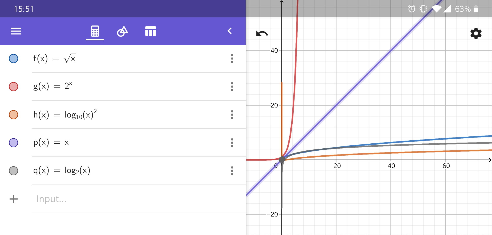
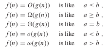
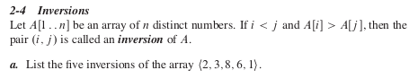
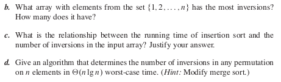

<h1>Eksamenatorier:</h1>

## 1. Eksamen juni 2008, opgave 2 
Tidligere eksamensopgaver kan findes øverst på kursets hjemmeside.

</img>

<b>ANSWER:</b>

Based on what is drawn on a graph calculator (Geogebra, maple, etch), the results are as following:

</img>

No order:

$\sqrt n$, &nbsp;&nbsp; $2^n$, &nbsp;&nbsp; $(log_{10} n)²$, &nbsp;&nbsp; $n$, &nbsp;&nbsp; $\log_2 n$

With asymptotic order:

$(log_{10} n)²$, &nbsp;&nbsp; $\log_2 n$, &nbsp;&nbsp; $\sqrt n$, &nbsp;&nbsp; , $n$, &nbsp;&nbsp; $2^n$

  
    
## 2. Eksamen juni 2011, opgave 2
</img>

</img>

<b>ANSWER:</b>

In order to understand how to solve these equations, it was necessary to understand some stuff about asymptotic notations and functions.

</img>

**Link:**
[There is more info from where it comes from here.](uge8_personalnotes.md)

(a) The equation is **true.**

(b) The equation is **true.**

(c) The equation is **true.**

The reason for why these equations are true, is simply because, if we follow the guidelines for asymptotic rules, they say that for 
 
 - **a)** the O-notation, is f(n)=O(g(n)) what it implies and since the symbol $\in$ means basically just the same as the equal-sign =, so that's simply why the equation is true in this case. And most importantly the O notation is the same as the math-symbol: $\leq$ which is why it is true in this case, since if any number is put in the equation, should either be like: a = b (leftside = rightside) or a < b (leftside < rightside) 
 
 - **b)** is true due to the same principle as a).
 
 - **c)** is true too because the equation is the same inside the paranteses in rightside of the equation as in the leftside and the rule of O-notation still implies here.

  

## 3. Eksamen januar 2007, opgave 3
***"Opgaven bruger notationen f(n) ∈ O(g(n)), hvilket betyder det samme som f(n) = O(g(n))"***

</img>

<b>ANSWER:</b>

1. **true**, because this equations says, n² is bigger/equal to $\Omega(n)$. Which is true, because 1=1 and even 2² $\geq$ 2, etc.

2. **false**, because the equation simply says n is equal to n², which isn't true, as you can't say 2²=2 or 4²=4.

3. **true**, you can guess why the answer is as it is, if you check up the answers from before.

4. **true**, -||-

5. **false**, -||-

The ! symbol is the factorial sign, which means that if you say e.g.
  $!1$, it means 1*1 = 1
 $!2$, it means 1*2 = 2
 $!3$, it means 1*2*3 = 6
 $!4$, it means 1*2*3*4 = 24
 etc.

It can actually be a good idea to look up these rules that implies for asymptotic equations, again (figure below).

</img>

Always remember that in these exercise, the symbol: $\in$ means this symbol =

  

## 4. Implementer Mergesort i Java

</img>
</img>

<b>ANSWER:</b>

**Not done**, since there was more focus on the assignments from now, and since we have done it before last year, it isn't nececssary to look into code as much. Just focus more on the theoretical stuffs, as the exam will be based on it.

  

## 5. Cormen et al. opgave 2-4 (side 41)

</img>
</img>

Løs spørgsmål d.

<b>ANSWER:</b>

The algorithm we will get in touch with is the following according to the hint the exercise suggested.

</img>

We will suggest a modified version of the merge sort algorithm. The modification is that we don’t touch the original array A (on line 14), but instead have a counter, which we count +1 to. This counter holds the information for how many inversions there is found in the original array.

  
